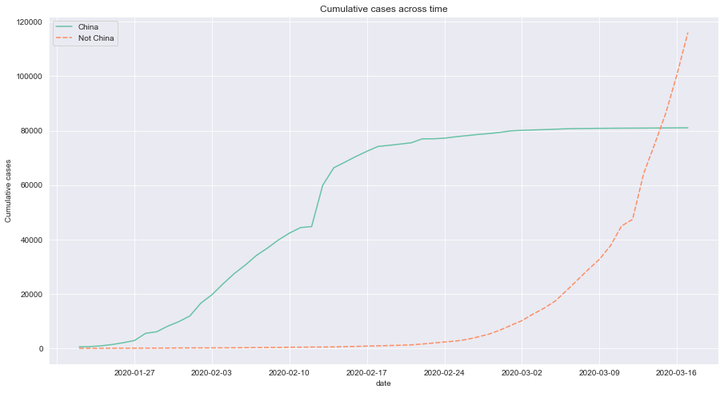
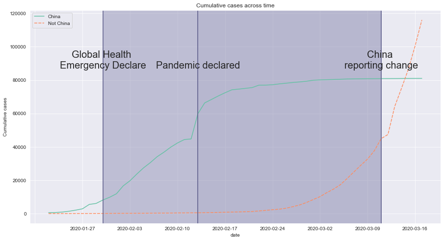
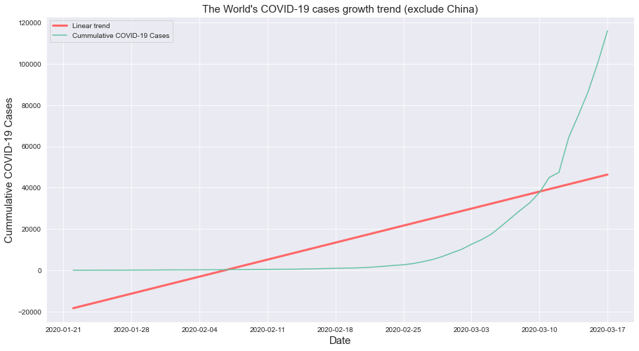
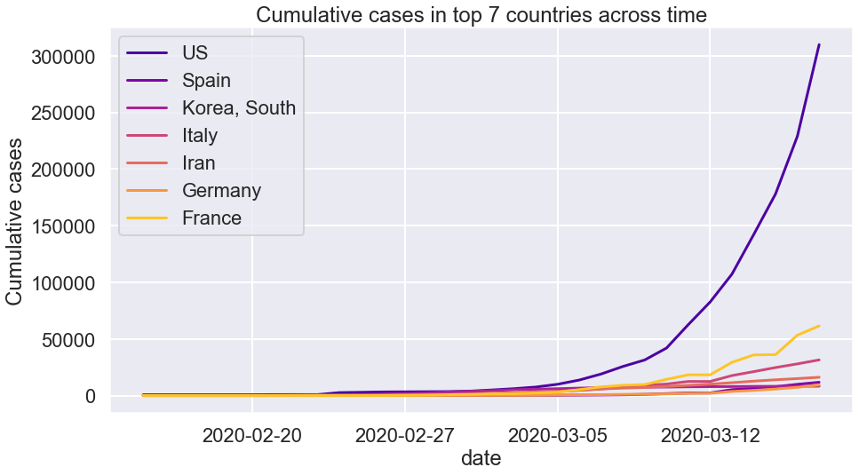

# COVID-19_Visualization
Introduction:
> - This notebook demostrates various programming functions and uses of data science knowledge with the 2020 COVID-19 dataset
> - Most of the content pratices the fundamental basic of data science analysis, thus it is able to determine if one has interest in this field without diving too deep
> - All documentation and codes can be found in the `covid-19_visualization.ipynb`
> - The datasets used are in the `datasets` folder and the images used along with the plots produced can be found in the `image_source` folder

## Visualization of covid-19 cases from 2020 throughout the globe
- The COVID-19 coronavirus first started to spread in China's Wuhan province in December 2019, and the World Health Organization (WHO) declared the COVID-19 outbreak a pandemic on March 11, 2020. Ever since, there have been large outbreaks all over the world.

- This notebook will visualize the spread of COVID-19 across the globe, along with a linear regression prediction.

Big thanks to organizations around the world, this notebook is only possible because the data collected by them. Notably, the Johns Hopkins University Center for Systems Science and Engineering created a <a href="https://github.com/RamiKrispin/coronavirus">publicly available data repository</a> to consolidate this data from sources like the WHO, the Centers for Disease Control and Prevention (CDC), and the Ministry of Health from multiple countries.<em> Please note that the COVID-19 information and data are still constantly being updated. This project's data is obtained on March 17, 2020, therefore it should not be regarded the most up-to-date data available.</em>

# Sneak peek:
- some of the plots produced in this notebook
- the codes can be found in the notebook

## China vs. World
- Accummulation of COVID-19 cases trend between China and the world

## Annotation of events
- Events that occur during the pandemic

## Demostrate linear regression
- The trend if the cases increase linearly 

## Multiple category plot
- Plotting for different country cases

